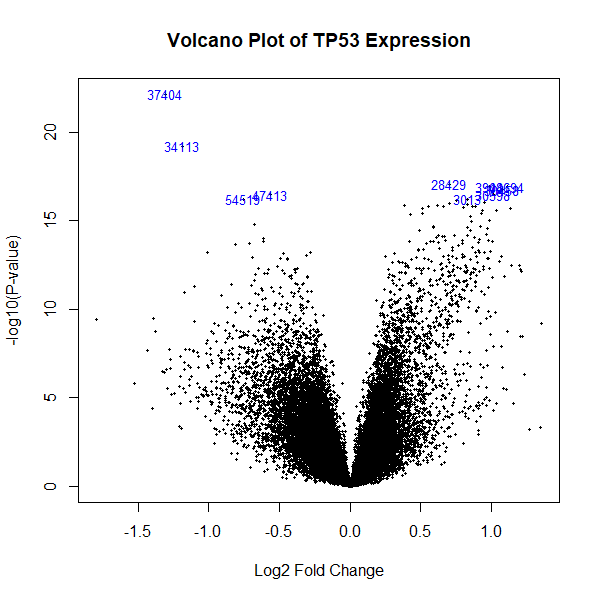
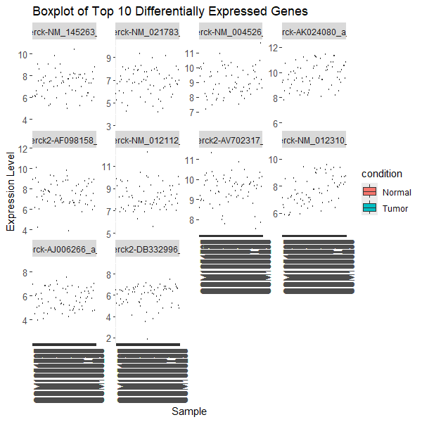
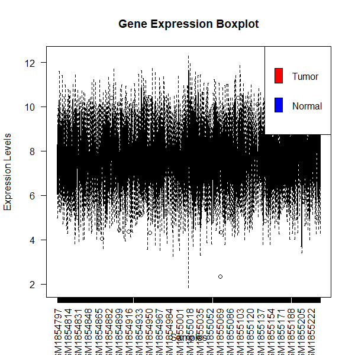

# Gene-Expression-Difference-Analysis-in-cancer
Gene Expression Difference Analysis in cancer, using R 
# Gene Expression Differences Analysis in Cancer Using R

### Prepared by: Prabhat Dhakal

### Learned from Hamidreza Bolhasani YouTube Channel

------------------------------------------------------------------------

# Background

## Biology of TP53 Gene in Cancer

- The [TP53 Gene]{.underline} is one of the most extensively studied
  tumor suppressor genes in cancer biology.

- It encodes the p53 protein, commonly referred to as the “guardian of
  the genome,” because of its critical role in maintaining genomic
  stability. The p53 protein regulates several cellular processes
  including DNA repair, apoptosis, cell cycle arrest, senescence, and
  metabolic regulation.

- When cellular DNA becomes damaged due to radiation, carcinogens,
  oxidative stress, or replication errors, p53 becomes activated and
  either repairs the damage or initiates programmed cell death to
  prevent malignant transformation.

- Mutations in TP53 are among the most frequent genetic abnormalities
  observed in human cancers.

- Studies have shown that more than 50% of human tumors harbor mutations
  in the TP53 gene, leading to loss of tumor suppressor activity and
  uncontrolled cellular proliferation. In lung cancer, TP53 mutations
  are particularly common and are associated with tumor aggressiveness,
  poor prognosis, metastasis, and resistance to therapy.

## TP53 and Lung Cancer

- [Lung Cancer]{.underline} remains one of the leading causes of
  cancer-related mortality worldwide. Several molecular pathways
  contribute to lung carcinogenesis, including abnormalities in EGFR,
  KRAS, ALK, and TP53 genes. Among these, TP53 mutations are considered
  early molecular events during tumor initiation and progression.

- Research indicates that mutant p53 proteins lose their ability to
  regulate transcription of genes involved in cell cycle control.
  Consequently, cancer cells evade apoptosis and continue proliferating
  despite genomic instability. Some mutant forms of p53 may even gain
  oncogenic functions that enhance invasion, angiogenesis, and
  metastatic potential.

- In transcriptomic studies, differential expression analysis of
  TP53-associated genes helps researchers identify biomarkers linked to
  cancer progression and therapeutic response. Microarray and RNA-seq
  technologies have become essential tools for understanding these
  expression changes at the genome-wide level.

# Gene Expression Analysis in Cancer

Gene expression analysis is a powerful bioinformatics approach used to
measure transcriptional changes between different biological conditions,
such as tumor versus normal tissues. By analyzing mRNA abundance,
researchers can identify genes that are significantly upregulated or
downregulated in disease conditions.

The development of high-throughput technologies such as microarrays and
next-generation sequencing has revolutionized cancer genomics. Public
repositories like [Gene Expression Omnibus]{.underline} provide freely
accessible datasets for computational analysis and reproducible
research.

In cancer biology, differential gene expression analysis serves several
important purposes:

- Identification of diagnostic biomarkers

- Discovery of therapeutic targets

- Understanding tumor biology and signaling pathways

- Prediction of prognosis and treatment response

- Classification of cancer subtypes

# GEO Database and Bioinformatics Tools

The current study uses the GEO dataset GSE72094 obtained from the NCBI
GEO repository. GEO datasets contain experimentally validated gene
expression profiles generated from clinical and laboratory samples.

Several R/Bioconductor packages are widely used for transcriptomic
analysis:

- [**GEOquery**]{.underline} enables downloading GEO datasets directly
  into R.

- [**limma**]{.underline} is a powerful statistical package for
  differential expression analysis.

- [**ggplot2**]{.underline} provides publication-quality graphics.

- [**reshape2**]{.underline} assists in transforming datasets for
  visualization.

The limma package applies linear modeling and empirical Bayes statistics
to estimate differential expression efficiently, especially in studies
with limited sample sizes. It has become one of the standard methods for
microarray and RNA-seq data analysis in cancer research.

# Introduction

This tutorial demonstrates how to perform differential gene expression
analysis using publicly available cancer datasets from the GEO database
in R. The workflow includes:

- Installing and loading packages
- Downloading GEO data
- Data preprocessing
- Differential expression analysis using `limma`
- Volcano plot visualization
- Boxplot visualization
- Biological interpretation of results

------------------------------------------------------------------------

# Step 1: Installing and Loading Packages

```{r setup, message=FALSE, warning=FALSE}

# Installing required packages if not already installed

if (!require("BiocManager", quietly = TRUE))
  install.packages("BiocManager")

if (!require("BiocGenerics", quietly = TRUE))
  install.packages("BiocGenerics")

# Installing GEOquery from Bioconductor
BiocManager::install("GEOquery")

# Loading required libraries

library(BiocManager)    # For installing Bioconductor packages
library(reshape2)       # Data reshaping
library(ggplot2)        # Data visualization
library(GEOquery)       # Download GEO datasets
library(limma)          # Differential expression analysis
```

# Step 2: Data Acquisition

In this section, we download gene expression data from the GEO database.

```{r setup, message=FALSE, warning=FALSE}
# GEO dataset ID
gseid <- "GSE72094"

# Downloading GEO dataset
gsedata <- getGEO(gseid, GSEMatrix = TRUE)

# Checking dataset availability
if (length(gsedata) == 0) {
  stop("Dataset not found.")
}

# Extracting expression matrix
exprdata <- exprs(gsedata[[1]])

# Extracting sample metadata
sampleinfo <- pData(gsedata[[1]])

# Display dataset dimensions
dim(exprdata)

# Preview sample information
head(sampleinfo)

```

# Step 3: Data Preprocessing

This step prepares the metadata and creates experimental groups.

```{r setup, message=FALSE, warning=FALSE}
# Reordering sample information to match expression data columns
sampleinfo <- sampleinfo[
  match(colnames(exprdata), rownames(sampleinfo)),
]

# Checking if TP53 status exists
if (!"tp53_status:ch1" %in% colnames(sampleinfo)) {
  stop("TP53 status column not found. Check column names.")
}

# Defining conditions
condition <- ifelse(
  sampleinfo$'tp53_status:ch1' == "Mut",
  "Tumor",
  "Normal"
)

# Creating sample table
sample_table <- data.frame(
  condition = factor(condition)
)

# Matching row names
row.names(sample_table) <- colnames(exprdata)

# Preview sample table
head(sample_table)

```

# Step 4 : Differential Expression Analysis

We use the limma package to identify differentially expressed genes.

```{r setup, message=FALSE, warning=FALSE}
# Creating design matrix
design <- model.matrix(~ condition, data = sample_table)

# Linear model fitting
fit <- lmFit(exprdata, design)

# Empirical Bayes moderation
fit <- eBayes(fit)

# Extracting top differentially expressed genes
results <- topTable(
  fit,
  coef = 2,
  number = 10
)

# Viewing top results
head(results)
```

# Step 5: Data Visualization

## A. Volcano Plot

The volcano plot shows statistical significance versus fold change.

```{r setup, message=FALSE, warning=FALSE}
volcanoplot(
  fit,
  coef = 2,
  main = "Volcano Plot of TP53 Expression",
  highlight = 10
)
```

## Volcano Plot Interpretation



Log2 fold change ranges approximately from -1.5 to 1.0. Significant
genes appear above 1.3 on the y-axis. Some transcripts demonstrate
strong upregulation and downregulation patterns.

## B. Boxplot of Top 10 Differentially Expressed Genes

```{r setup, message=FALSE, warning=FALSE}
# Extracting top genes
topgenes <- topTable(fit, coef = 2, number = 10)

# Getting gene IDs
topgeneids <- rownames(topgenes)

# Expression matrix for top genes
topexprdata <- exprdata[topgeneids, ]

# Melting data for ggplot
exprmelted <- melt(topexprdata)

# Adding condition labels
exprmelted$condition <- rep(
  sample_table$condition,
  each = nrow(topexprdata)
)

# Creating boxplot
ggplot(exprmelted,
       aes(x = Var2,
           y = value,
           fill = condition)) +
  geom_boxplot() +
  labs(
    x = "Sample",
    y = "Expression Level",
    title = "Boxplot of Top 10 Differentially Expressed Genes"
  ) +
  facet_wrap(~ Var1, scales = "free_y") +
  theme(
    axis.text.x = element_text(angle = 90, hjust = 1),
    axis.text = element_text(size = 10)
  )
```

## Boxplot Interpretation



Expression levels range approximately between 4 and 12 log scale Tumor
and normal samples show overlapping patterns Outliers may indicate
potential biomarkers Subtle changes suggest altered regulatory
mechanisms in tumor tissues

## C. Boxplot Expression Comparison Between Tumor and Normal Samples

```{r setup, message=FALSE, warning=FALSE}
# Color assignment
colorvector <- ifelse(
  sample_table$condition == "Tumor",
  "red",
  "blue"
)

# Boxplot visualization
boxplot(
  exprdata[topgeneids, ],
  main = "Gene Expression Boxplot",
  xlab = "Samples",
  ylab = "Expression Levels",
  col = colorvector,
  las = 2
)

legend(
  "topright",
  legend = c("Tumor", "Normal"),
  fill = c("red", "blue")
)
```



## Step 6: Biological Interpretation

A. Volcano Plot Analysis

Differentially expressed genes demonstrate altered transcriptional
activity Both upregulated and downregulated genes are observed Highly
significant genes may represent important cancer biomarkers

B. Boxplot Analysis

Tumor samples exhibit expression variability Some genes display elevated
expression in cancer tissue Gene dysregulation may contribute to cancer
progression Conclusion

This analysis demonstrates how publicly available GEO datasets can be
used to identify differentially expressed genes in cancer using R and
Bioconductor tools.

## Key findings include:

-Significant dysregulation of TP53-related transcripts -Presence of both
upregulated and downregulated genes -Potential biomarkers identified
through statistical analysis and visualization

This workflow provides a foundation for advanced transcriptomic and
cancer bioinformatics studies.

# Session Information

```{r setup, message=FALSE, warning=FALSE}

sessionInfo()
